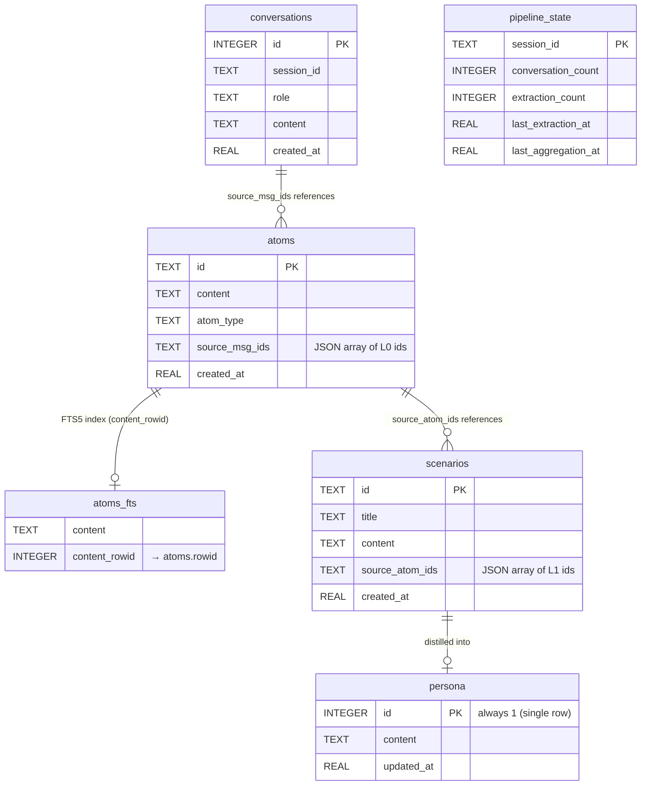

# MyAI Memory — Personal AI Memory System

A self-contained, solo-use AI memory built on the **L0 → L1 → L2 → L3** layered
memory pattern (extracted from the TencentDB-Agent-Memory codebase). No teams,
no agents, no proxy infrastructure required — just you and your LLM.

```
Raw conversations → LLM extracts facts → facts grouped into scenarios → distilled into a persona
```

## What it does

| Layer | What it stores | How it's created |
|-------|---------------|------------------|
| **L0** | Raw conversations | You feed them in |
| **L1** | "Atoms" — facts, preferences, decisions | LLM extracts from L0 |
| **L2** | "Scenarios" — grouped knowledge blocks | LLM groups L1 atoms |
| **L3** | "Persona" — long-term profile | LLM distills L2 |

On recall, it assembles context **top-down**: persona → scenarios → atoms, capped
by a character budget so memory never overflows the context window.

## Database schema (L0 → L3)



| Layer | Table | Relationship |
|-------|-------|--------------|
| **L0** | `conversations` | Raw messages, one row per message |
| **L1** | `atoms` | Extracted facts; `source_msg_ids` (JSON) points back to L0 message IDs |
| **L1 index** | `atoms_fts` | FTS5 virtual table for BM25 search; `content_rowid` links to `atoms.rowid` |
| **L2** | `scenarios` | Grouped knowledge; `source_atom_ids` (JSON) points back to L1 atom IDs |
| **L3** | `persona` | Single-row profile distilled from scenarios |
| **State** | `pipeline_state` | Tracks extraction/aggregation counts per session |

> **Note:** The layer relationships are stored as **JSON arrays** (not foreign-key
> join tables) — a simplification vs. the normalized design in the real
> `MemoryCore`, which uses proper relational tables + vector indexes.

## Files

| File | Purpose |
|------|---------|
| `store.py` | SQLite + FTS5 storage (L0/L1/L2/L3 + pipeline state) |
| `extract.py` | L0 → L1 LLM extraction + dedup |
| `aggregate.py` | L1 → L2 → L3 LLM aggregation |
| `recall.py` | BM25 search + top-down context assembly |
| `claude_adapter.py` | Claude Code request parsing (classify + strip harness noise) |
| `main.py` | Interactive chat loop + chat import CLI |
| `proxy.py` | Optional proxy to connect Claude Code to your memory |
| `.env.proxy` | Env template for the proxy |

## Requirements

- Python 3.10+
- An LLM API. Works with **DeepSeek**, **OpenAI**, **Ollama**, or any
  OpenAI-compatible endpoint.

## Install

```bash
cd my-ai-memory
pip install -r requirements.txt
```

---

## Usage 1 — Interactive memory loop (`main.py`)

The simplest way to try it. Chat, and it remembers.

```bash
# DeepSeek
export LLM_API_KEY="sk-<your-deepseek-key>"
export LLM_BASE_URL="https://api.deepseek.com/v1"
export LLM_MODEL="deepseek-chat"

# or Ollama
# export LLM_API_KEY="ollama"
# export LLM_BASE_URL="http://localhost:11434/v1"
# export LLM_MODEL="llama3.2"

python main.py
```

### Interactive commands

| Command | What it does |
|---------|--------------|
| `quit` / `exit` | Stop |
| `!persona` | Show your L3 profile |
| `!atoms` | Search your L1 memories |
| `!force` | Force extraction + aggregation now |

### Import a chat export

```bash
python main.py --import chat.json
```

`chat.json` is a JSON array of `{"role": "user"|"assistant", "content": "..."}`.

### Env vars (`main.py`)

| Var | Default | Purpose |
|-----|---------|---------|
| `LLM_API_KEY` | — | LLM API key |
| `LLM_BASE_URL` | OpenAI | OpenAI-compatible endpoint |
| `LLM_MODEL` | `gpt-4o-mini` | Model name |
| `EXTRACT_EVERY_N` | `5` | Conversations per extraction |
| `AGGREGATE_EVERY_N` | `3` | Extractions per aggregation |

---

## Usage 2 — Connect Claude Code to your memory (`proxy.py`)

A minimal proxy that sits between Claude Code and the LLM. It injects recalled
memory into the system prompt and captures conversations back into L0.

```
claude CLI ──→ proxy.py :8096 ──→ Anthropic-compatible upstream
                    │
                    ├─ recall() → inject memory into system prompt
                    ├─ capture user+assistant → store.add_conversation()
                    └─ periodically: extract / aggregate
```

### Setup

```bash
cd my-ai-memory
pip install -r requirements.txt

# Create your local env file (keeps keys private)
cp .env.proxy .env.proxy.local
# edit .env.proxy.local — replace REPLACE_ME with your keys
```

For **DeepSeek** (same key for both endpoints):

```dotenv
UPSTREAM_BASE_URL=https://api.deepseek.com/anthropic
UPSTREAM_API_KEY=sk-<your-deepseek-key>
LLM_BASE_URL=https://api.deepseek.com/v1
LLM_MODEL=deepseek-chat
LLM_API_KEY=sk-<your-deepseek-key>
```

### Start the proxy

```bash
python proxy.py        # listens on :8096
```

### Launch Claude Code

```bash
export ANTHROPIC_BASE_URL=http://127.0.0.1:8096
export ANTHROPIC_AUTH_TOKEN=anything
claude
```

On the first message of a new session, Claude Code shows an `AskUserQuestion`
form: **"Connect this session to your memory?"** — choose yes to enable memory
injection + capture, or no to pass through.

### Env vars (`proxy.py`)

| Var | Default | Purpose |
|-----|---------|---------|
| `UPSTREAM_BASE_URL` | `https://api.anthropic.com` | Chat upstream (Anthropic-compatible) |
| `UPSTREAM_API_KEY` | — | Chat upstream key |
| `LLM_BASE_URL` | `https://api.deepseek.com/v1` | Extraction/aggregation endpoint |
| `LLM_MODEL` | `deepseek-chat` | Extraction/aggregation model |
| `LLM_API_KEY` | — | Extraction/aggregation key |
| `PROXY_PORT` | `8096` | Listen port |
| `EXTRACT_EVERY_N` | `5` | Conversations per extraction |
| `AGGREGATE_EVERY_N` | `3` | Extractions per aggregation |

---

## How the memory pipeline works

```
Every turn:
  store.add_conversation()          ← L0: raw storage
  recall(store, query)             ← assemble context for the LLM

Every N conversations (default 5):
  extract_atoms()                   ← L1: LLM extracts facts
  deduplicate_atoms()               ← L1: remove duplicates
  store.add_atoms()                 ← L1: persist

Every M extractions (default 3):
  build_scenarios()                 ← L2: group atoms into topics
  store.add_scenario()              ← L2: persist
  build_persona()                   ← L3: distill persona
  store.set_persona()               ← L3: persist
```

## Key design decisions

| Decision | Why |
|----------|-----|
| **SQLite + FTS5** | Zero deps, free BM25 search, single-file backup |
| **Content-hash IDs** | Same fact = same ID → natural dedup |
| **LLM does the heavy lifting** | Extraction, dedup, aggregation all use the LLM |
| **Budget cap on recall** | `MAX_CONTEXT_CHARS` prevents memory from eating context |
| **Top-down recall** | L3 → L2 → L1: start broad, get specific |
| **Batch triggers** | Don't extract every turn — process every N conversations |
| **Claude Code adapter** | Strip harness noise so you only store real user input |

## Notes & limitations

- `proxy.py` is a **simplified** reimplementation of the real `MemoryProxy` —
  it captures the core loop (classify → extract → recall → inject → forward →
  capture) without auth, multi-agent, skills, or observability.
- Session state in `proxy.py` is **in-memory** — it resets when the proxy restarts.
- The SSE form injection in `proxy.py` may need tuning against your Claude Code
  version.
- Data is stored in `my_memory.db` (SQLite). Backup = copy the file.
